# Estructuras-De-Control
#Autor: Juan Camilo Páez Guaspud
#Ejercicios de Practica: 

A continuación, se realizó unos ejercicios de práctica con el fin de repasar las estructuras básicas de control en python

Ejercicio 01
-Se usa "print" para que el programa imprima algo en la pantalla de salida, en este caso, se va a imprimir la frase "Hola, ya se imprimir frases en Python"
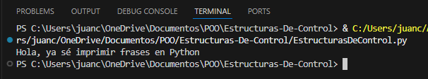

Ejercicio 03
El ejercicio es lo mismo que el ejercicio uno, con la diferencia de que se imprime un numero decimal, para esto, usaremos el comando float para que permita numeros decimales, luego, imprimirá "3.14"
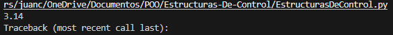

Ejercicio 04
Sumaremos dos valores dados por el usuario, con comando input, recibe los valores del usuario por consola, almacenamos los valores en distintas variables e imprimimos los valores recibidos, sumandolos dentro de print
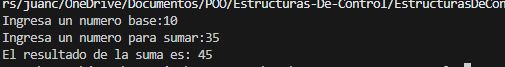

Ejercicio 08
Se va a imprimir los numeros del 1 al 3, usaremos el comando de bucle for, especificamos el rango de numeros, y luego le pedimos que lo imprima:
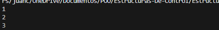

Ejercicio 10
Imprimir los numeros del 1 al 10000, usaremos el mismo comando anterior, y cambiamos el rango a 10000, imprimimos:
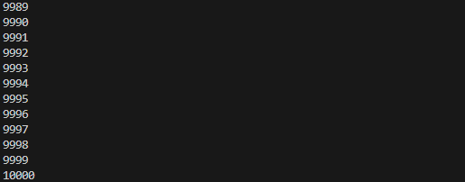

Ejercicio 14
Imprimir Hola 200 veces, usando for i in range, especificamos el rango, e imprimimos la palabra "Hola" solo una vez:
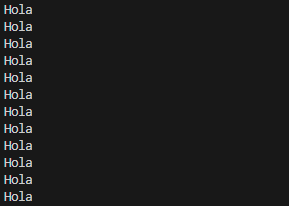

Ejercicio 15
Imprime los cuadrados de los numeros del 1 al 30, usando for i in range, dentro de print, usamos ** para especificar que i está elevado a la 2:
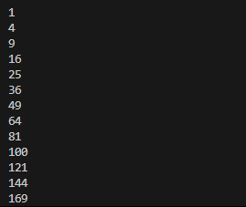

Ejercicio 16
Imprime el factorial de 20, definimos una variable con el numero 1, usamor for i in range, especificamos rango, especificamos que el numero uno (la variable resultado) se va a multiplicar por el rango igual a i, imprimir resultado:
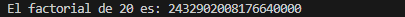

Ejercicio 17
Imprime la suma de los cuadrados de los primeros 100 numeros, definimos una variable con el numero uno, usamos for i in range, especificamos rango, especificamos que el numero uno (resultado) se va a sumar con los cuadrados de i:
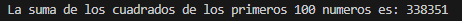

Ejercicio 18
Imprime la suma de los 100 primeros numeros siguientes desde un numero dado por el usuario, definimos input dentro de una variable, definimos otra variable llamada suma con valor igual a 0, usamos for i in range y definimos su rango, la variable suma se sumará con el numero dado por el usuario mas 1, imprimimos suma:
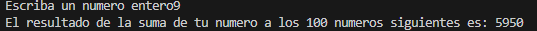

Ejercicio 19
Recibira un valor en euros y los convertira a dolares, definimos imput dentro de una variable float que permita decimales, usamos otra variable que tome el resultado dado por el usuario y se multiplicará por el valor del dolar, que es igual a 1.17, imprimimos las variables separadas por comas:
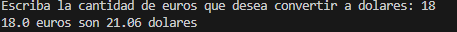

Ejercicio 20
Calcula el area de un triangulo, pediremos dos valores por consola, definidos por variables float, definimos una ultima variable (area) que hará la operación de los dos valores dados para hallar el area (base por altura sobre 2), imprimimos variable area:
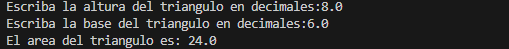

Ejercicio 21
Imprime el numero mayor y menor entre dos numeros dados por el usuario, pedimos dos valores por consola, definidos entre variables int, usamos el comando de sentencia if, determinamos si el valor 1 es mayor que el valor 2, si es asi, imprime 
por orden ascendente, sino, imprime el valor 2 de primeras, se hace un else en caso de que ambos numeros sean iguales, imprime "Los numeros son iguales":
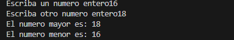
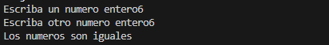

Ejercicio 22
Imprime todos los numero impares menores que el numero recibido por consola, definimos el valor dado por consola en una variable int, usamos for i in range, definimos rango 1, el rango 2 será dado por la variable dada mas 1, y el rango 3 definirá que no tomará un valor cada dos valores, imprimimos i:
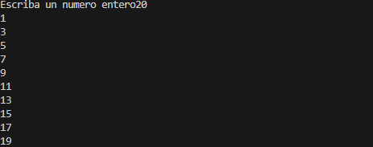

Ejercicio 26
Imprime los tres numeros dados por el usuario ordenados de mayor a menor, definimos los 3 valores input dados por consola dentro de variables int, usamos if, para identificar el orden ascendente de cada variable usando else y elif, imprimimos dependiendo de su orden (num1,num2,num3),(num2,num3,num1), etc.
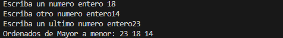

Ejercicio 30
Detecta e imprime todos los numeros primos hasta su limite dado por el usuario, definimos el valor input dentro de una variable int, usamos for i in range (2,variable) (desde 2 ya que 1 no es valido), usamos if dentro de for y agregamos in [2,3,4,7] para imprimir los numeros 2,3,5 y 7, luego, identifica si la variable i es multiplo de 2 exponencial igual a 0, lo mismo con 3,5 y 7, imprimimos la variable i:
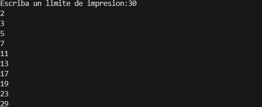

